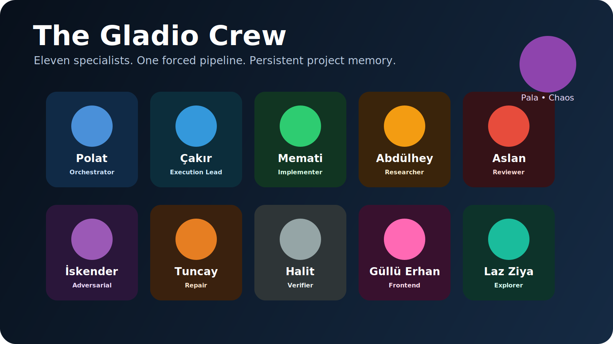
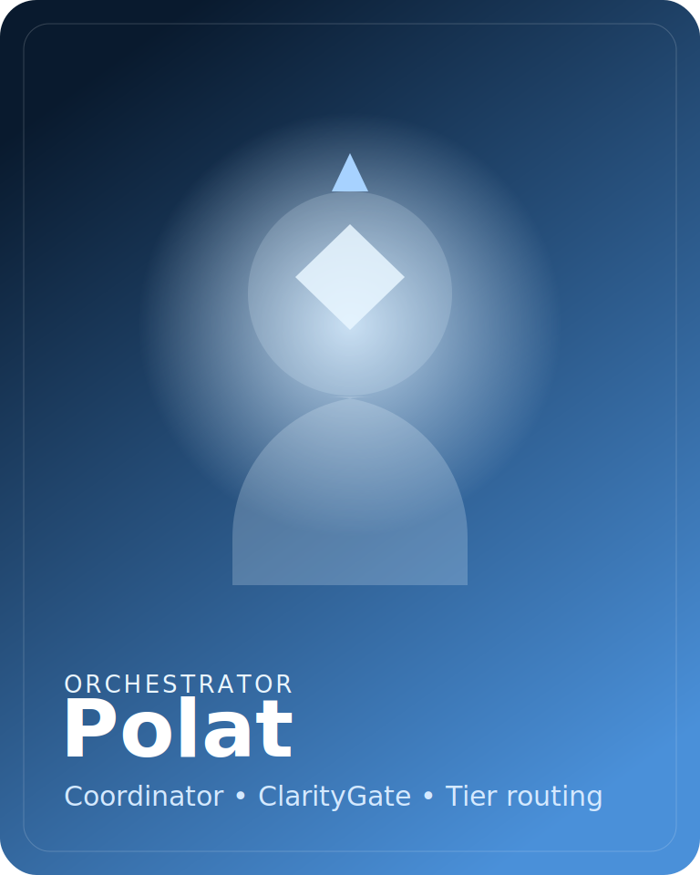
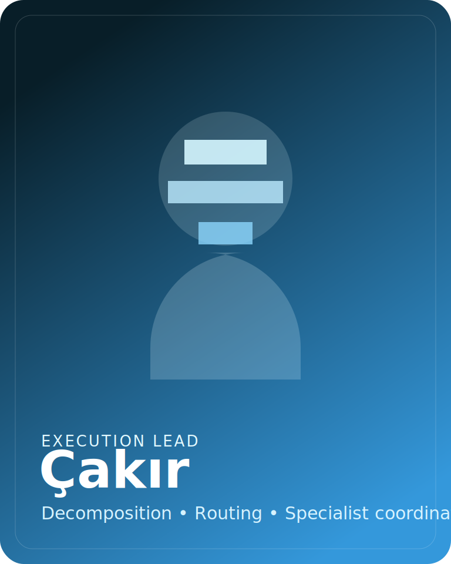
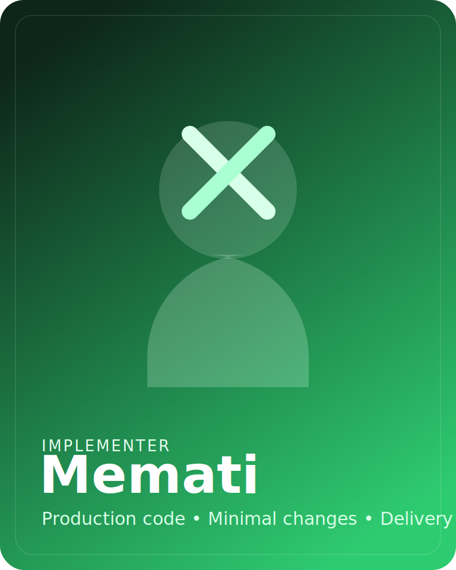
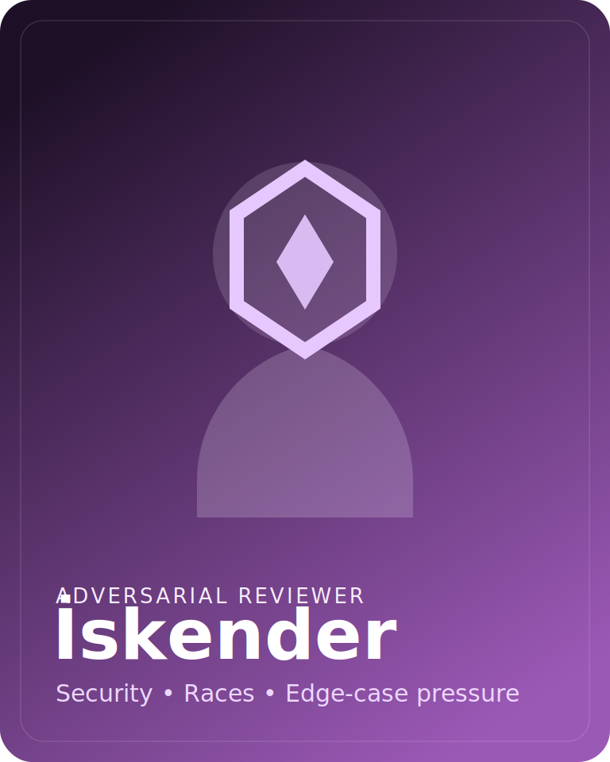
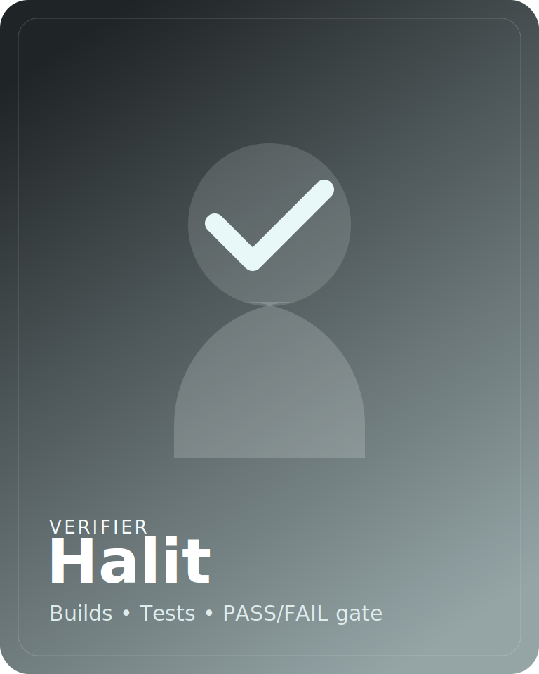
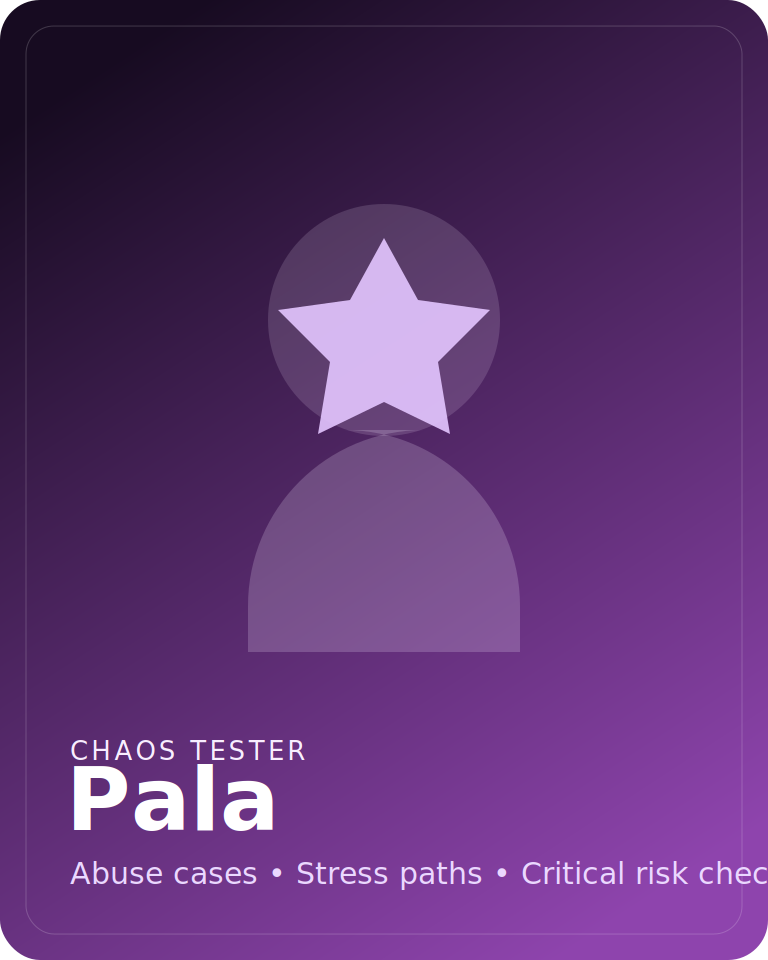

<div align="center">

# opencode-gladio

[](./img/team.svg)

**Disciplined orchestration plugin for [OpenCode](https://opencode.ai)**

Eleven specialists. Forced 4-tier delivery pipeline. Persistent project memory.

[](https://www.npmjs.com/package/opencode-gladio)
[](https://www.npmjs.com/package/opencode-gladio)
[](https://github.com/beydemirfurkan/opencode-gladio/blob/main/LICENSE)
[](https://opencode.ai)

</div>

---

## Why Gladio

Most OpenCode setups optimize for flexibility.

Gladio optimizes for **discipline**:

- ambiguity gets challenged before execution
- work is forced into a tiered pipeline
- risky changes get reviewed, verified, and repaired
- project learnings survive across sessions in `.gladio/`

This is closer to a senior-engineer operating layer than a simple agent preset.

## Quick Start

```bash
npx opencode-gladio@latest install
```

Or install globally:

```bash
npm i -g opencode-gladio
opencode-gladio install
```

After install, open OpenCode and start with your task. `polat` coordinates the rest.

## Verify Your Setup

Inside OpenCode, run:

```text
ping polat
```

Then try a real task, or check the generated config:

```bash
opencode-gladio doctor
opencode-gladio config show --json
```

## The Pipeline

```text
User task
   ↓
ClarityGate
   ↓
Tier classification
   ↓
Forced worker chain
   ↓
Verification / review / repair
   ↓
Done
```

### Tier Matrix

| Tier | Trigger | Forced pipeline |
|------|---------|-----------------|
| **1** | Single-file trivial work | `polat` implements directly |
| **2** | Standard low-risk changes | `memati` -> `halit` |
| **3** | Risky or multi-file work | `memati` -> `halit` -> `aslan-akbey` + `iskender` -> `tuncay` if needed |
| **4** | Critical paths, data, production risk | Tier 3 + `pala` chaos testing |

### What Makes Gladio Different

- **ClarityGate**: vague asks trigger focused questions before work starts
- **Dual review**: risky work gets both correctness and adversarial review
- **Pipeline integrity hooks**: phase reminders, retry nudges, todo continuation, patch rescue signals
- **Persistent memory**: Gladio stores high-value learnings in `.gladio/context.json`
- **Project facts injection**: languages, frameworks, package manager, and session context feed the coordinator

## Persistent Project Memory

Gladio `0.5.0` adds repo-local persistent memory.

Generated files:

- `.gladio/context.json`
- `.gladio/pipeline-state.json`
- `.gladio/project.json`

Built-in tools:

- `gladio-learn`
- `gladio-recall`

CLI helpers:

```bash
opencode-gladio memory show
opencode-gladio memory show --json
opencode-gladio memory forget <id>
opencode-gladio memory reset
```

The installer also adds `.gladio/` to `.gitignore` automatically.

## Meet the Crew

### Polat

[](./img/agents/polat.svg)

**Role:** Orchestrator and final coordinator.

`polat` owns ClarityGate, tier routing, delegation, and final synthesis.

### Çakır

[](./img/agents/cakir.svg)

**Role:** Execution lead.

`cakir` breaks larger asks into scoped tasks and routes specialists.

### Memati

[](./img/agents/memati.svg)

**Role:** Implementer.

`memati` makes the code changes and carries the main delivery path.

### Abdülhey

[](./img/agents/abdulhey.svg)

**Role:** Researcher.

`abdulhey` digs through docs, APIs, evidence, and rationale.

### Aslan Akbey

[](./img/agents/aslan-akbey.svg)

**Role:** Correctness reviewer.

`aslan-akbey` checks maintainability, logic, and production safety.

### İskender

[](./img/agents/iskender.svg)

**Role:** Adversarial reviewer.

`iskender` looks for edge cases, misuse, security gaps, and race conditions.

### Tuncay

[](./img/agents/tuncay.svg)

**Role:** Repair specialist.

`tuncay` performs scoped repairs after review failures.

### Halit

[](./img/agents/halit.svg)

**Role:** Verifier.

`halit` runs the build-test gate and reports pass/fail clearly.

### Güllü Erhan

[](./img/agents/gullu-erhan.svg)

**Role:** Frontend specialist.

`gullu-erhan` handles UI quality, layout polish, and implementation aesthetics.

### Laz Ziya

[](./img/agents/laz-ziya.svg)

**Role:** Explorer.

`laz-ziya` rapidly maps the repo and finds the right files and patterns.

### Pala

[](./img/agents/pala.svg)

**Role:** Chaos tester.

`pala` pressure-tests critical flows with hostile or abnormal scenarios.

## CLI

```bash
opencode-gladio install
opencode-gladio fresh-install
opencode-gladio uninstall
opencode-gladio doctor
opencode-gladio config show --json
opencode-gladio memory show --json
opencode-gladio memory forget <id>
opencode-gladio memory reset
opencode-gladio print-config
```

## Configuration

Global config path:

```text
~/.config/opencode/opencode-gladio.jsonc
```

Project-local memory is controlled through the `memory` block:

```jsonc
{
  "$schema": "https://unpkg.com/opencode-gladio@latest/opencode-gladio.schema.json",
  "schema_version": 2,
  "memory": {
    "enabled": true,
    "dir": ".gladio",
    "max_learnings": 100,
    "inject_summary": true
  }
}
```

Useful config areas:

```jsonc
{
  "ui": {
    "worker_visibility": "visible"
  },
  "hooks": {
    "profile": "standard",
    "phase_reminder": true,
    "todo_continuation": true,
    "apply_patch_rescue": true,
    "json_error_recovery": true,
    "delegate_retry": true,
    "chat_headers": true
  },
  "fallbacks": {
    "enabled": true,
    "chains": {
      "polat": ["zai/glm-5.1", "openai/gpt-5.4"],
      "halit": ["opencode-go/kimi-k2.5", "zai/glm-5.1"]
    }
  }
}
```

## Architecture

```text
src/
├── index.ts              # Plugin entry
├── agents.ts             # 11 agent definitions
├── config.ts             # Config schema, defaults, merging
├── cli.ts                # Installer + memory CLI
├── installer.ts          # OpenCode install wiring
├── doctor.ts             # Health diagnostics
├── tier-router.ts        # 4-tier classification helpers
├── fallback-manager.ts   # Runtime model fallback
├── fallbacks.ts          # Startup fallback resolution
├── mcp.ts                # Remote MCP registration
├── project-facts.ts      # Language/framework detection
├── memory/
│   └── index.ts          # Persistent memory store
├── tools/
│   └── index.ts          # gladio-learn / gladio-recall
├── prompts/
│   ├── coordinator.ts
│   ├── workers.ts
│   └── layers.ts
├── hooks/
│   ├── session-start.ts
│   ├── system-prompt.ts
│   ├── pre-tool-use.ts
│   ├── post-tool-use.ts
│   ├── phase-reminder.ts
│   ├── todo-continuation.ts
│   ├── apply-patch.ts
│   ├── json-error-recovery.ts
│   ├── delegate-task-retry.ts
│   ├── filter-available-skills.ts
│   ├── chat-headers.ts
│   ├── stop.ts
│   ├── session-end.ts
│   ├── runtime.ts
│   └── sdk.ts
└── __tests__/            # Unit tests
```

## Development

```bash
git clone https://github.com/beydemirfurkan/opencode-gladio.git
cd opencode-gladio
bun install
bunx tsc --noEmit
bun test
bun run build
```

## License

MIT
